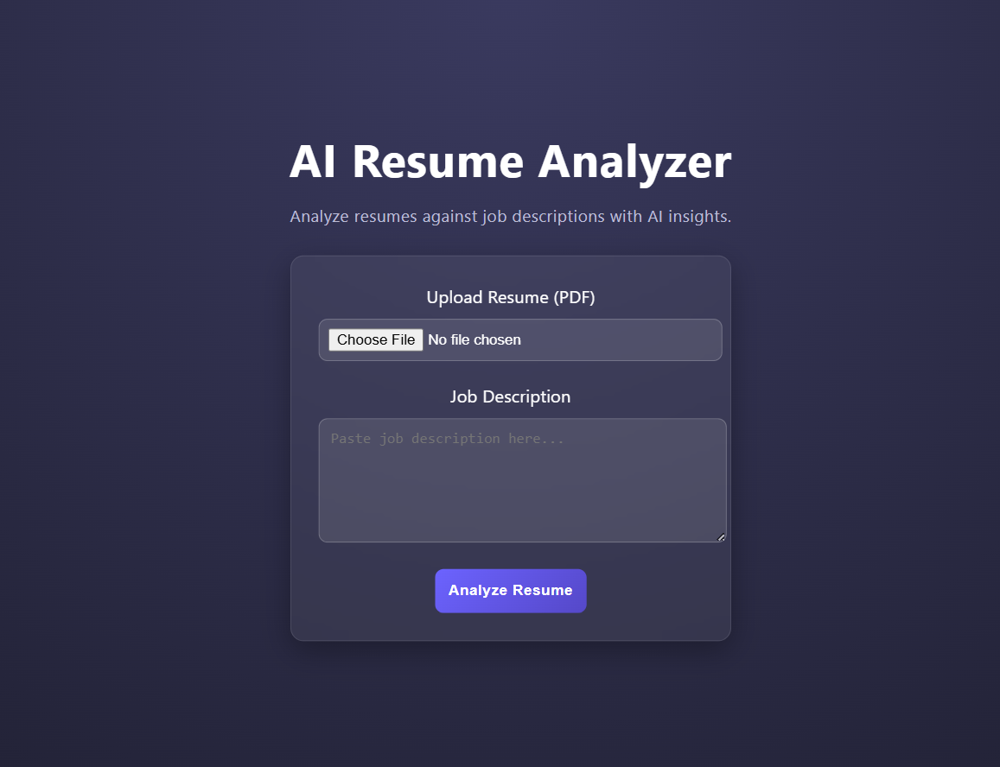
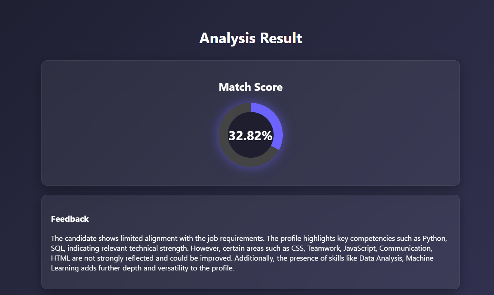
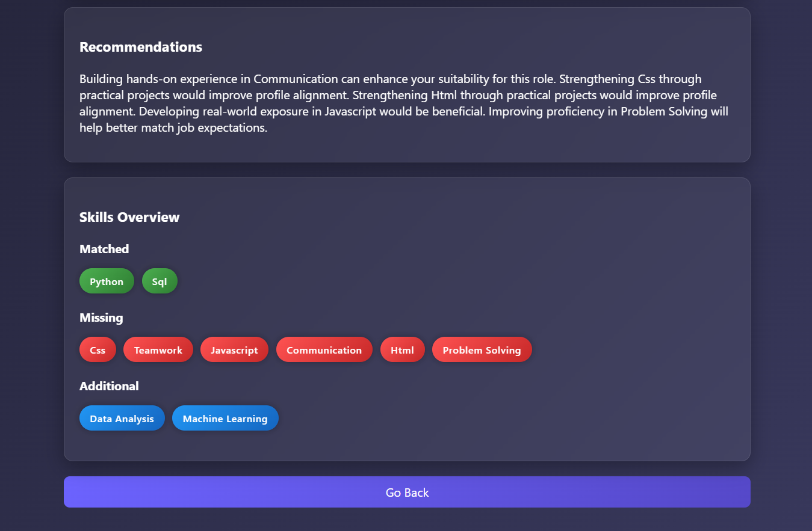

# AI-Powered Resume Analyzer

## 📌 Overview

AI-Powered Resume Analyzer is a machine learning-based web application that evaluates resumes against job descriptions to determine compatibility. It extracts key skills, computes similarity scores, and generates actionable feedback to help improve resumes for targeted roles.

---

## 🚀 Features

* 📄 Resume parsing from PDF
* 🧠 NLP-based skill extraction
* 🔍 Resume vs Job Description matching
* 📊 Scoring system using similarity + skill matching
* 💡 Automated feedback generation
* 🎯 Skill gap identification with recommendations
* 🎨 Clean and modern UI

---

## 🛠️ Tech Stack

* **Frontend:** HTML, CSS
* **Backend:** Flask (Python)
* **Machine Learning / NLP:**

  * TF-IDF Vectorization
  * Sentence Transformers (MiniLM - local use)
* **Libraries:** scikit-learn, pdfplumber, numpy, pandas

---

## ⚙️ How It Works

1. Upload a resume (PDF format)
2. Enter a job description
3. System extracts skills from both inputs
4. Computes similarity score
5. Displays:

   * Match Score
   * Skills comparison
   * Feedback
   * Recommendations

---

## 📸 Screenshots

### 🏠 Home Interface



---

### 📊 Analysis Result



---

### 🧠 Skills & Recommendations



---

## 📊 Sample Output

* Match Score (%)
* Matched Skills
* Missing Skills
* Additional Skills
* Personalized Feedback
* Recommendations for improvement

---

## ⚠️ Note

The full semantic similarity model (Sentence Transformers) is used in the local environment.
Deployment may require optimization due to resource constraints of free-tier hosting services.

---

## 📂 Project Structure

```
resume-analyzer/
│
├── app.py
├── ml/
│   ├── extractor.py
│   ├── skill_extractor.py
│   ├── skill_matcher.py
│   ├── similarity.py
│   ├── scorer.py
│   ├── feedback_generator.py
│   └── recommender.py
│
├── templates/
├── static/
├── assets/
│   ├── home.png
│   ├── result.png
│   └── skills.png
│
├── requirements.txt
└── README.md
```

---

## 👤 Author

**Bijay Benny**

---

## 💡 Future Improvements

* Optimize model for cloud deployment
* Add real-time resume rewriting suggestions
* Improve UI with advanced analytics visualization
* Support multiple resume formats (DOCX, TXT)

---
